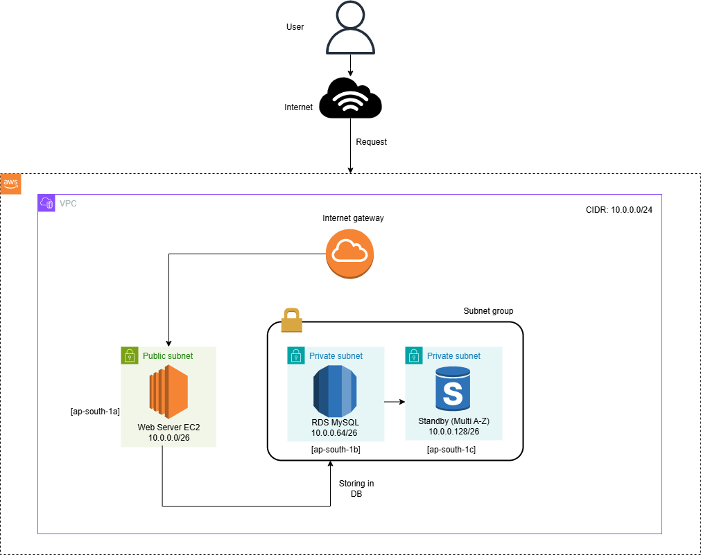

# ☁️ Cloud Deployment: PHP Web Application on AWS

> 🚨 Note: This project showcases my ability to deploy and configure a cloud-native infrastructure on AWS.  
> The PHP application used is open-source and not authored by me. The focus here is on **infrastructure setup, server provisioning, and secure deployment**.

---

## 📌 Project Overview

This deployment simulates a real-world production setup of a PHP-based student management system on AWS using:

- Amazon EC2 (for web server)
- Amazon RDS (MySQL-compatible)
- Custom VPC with public and private subnets
- Security groups, route tables, and internet gateway
- Manual `.sql` import via CLI from EC2 to RDS

---

## 🧱 Architecture Diagram

📷 
✅ Example layout:
- Public subnet (EC2 instance)
- Private subnet (RDS instance)
- Another private subnet (standby)
- IGW attached to public subnet
- Separate route tables
- SSH and HTTP configured via security group rules

---

## 🛠️ Tools & Services Used

- **AWS EC2** – Amazon Linux 2023 (Apache, PHP)
- **AWS RDS** – MySQL 8.0 with private subnet group
- **AWS VPC** – Custom VPC with 3 subnets across 2+ AZs
- **AWS IAM** – Secure access via key pair
- **Git + CLI** – Used to clone and configure the PHP app
- **MySQL CLI** – Used to import `.sql` into RDS from EC2
- **Netcat (`nc`)** – Used to test DB port access from EC2

---

## 🌐 Deployment Steps (Summary)

1. ✅ **Create VPC and Subnets**
   - CIDR: `10.0.0.0/24`
   - Subnet A (public): `10.0.0.0/26`
   - Subnet B (private): `10.0.0.64/26` (RDS)
   - Subnet C (private standby): `10.0.0.128/26`

2. ✅ **Attach IGW and Route Tables**
   - Public RT → IGW route `0.0.0.0/0`
   - Associate subnets correctly

3. ✅ **Launch EC2 Instance**
   - Amazon Linux 2023
   - Installed Apache, PHP, MySQL client
   - Cloned project using Git
   - Edited `config.php` to point to RDS

4. ✅ **Create RDS MySQL DB**
   - Placed in private subnet
   - Security group allows access only from EC2
   - Connected using CLI + imported `.sql` file

5. ✅ **Test & Validate**
   - Accessed app via EC2 public IP
   - Verified DB interaction using MySQL CLI
   - Used `nc` and browser to validate ports and UI

---

## 📸 Screenshots

### 🔧 AWS Console Setup

- 
shot (597).png)  
- [ ] Subnet and route table setup  
- [ ] EC2 instance launch & SG config  
- [ ] RDS instance and subnet group  
- [ ] Security Group inbound rules  

### 💻 EC2 Server Configuration

- [ ] Apache + PHP install  
- [ ] Git clone of project  
- [ ] Editing PHP config  
- [ ] Importing SQL  
- [ ] Accessing web app in browser  
